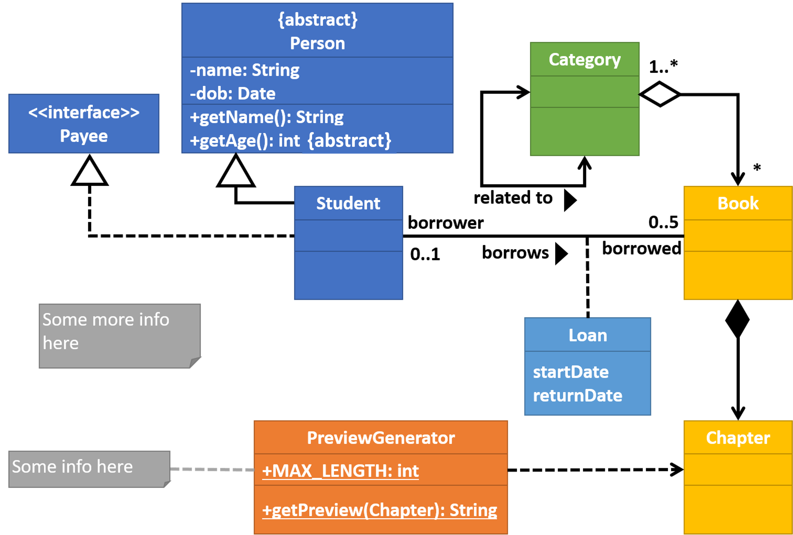

<panel header="{{ icon_Q }} Are you able to interpret CD/OD notations?" expanded>

<question>
Study the following class and object diagrams. Are you able to interpret all notations?

</question>
</panel>
