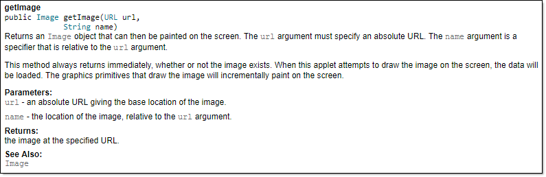


<span id="title">What</span>

<span id="prereqs"></span>

<span id="outcomes">{{ icon_outcome }} Can explain JavaDoc</span>

<div id="body">

**JavaDoc is a tool for generating API documentation in HTML format from comments in the source code.** In addition, modern IDEs use JavaDoc comments to generate explanatory tooltips.


A method header comment in JavaDoc format:

```java
/**
 * Returns an Image object that can then be painted on the screen.
 * The url argument must specify an absolute {@link URL}. The name
 * argument is a specifier that is relative to the url argument.
 * <p>
 * This method always returns immediately, whether or not the
 * image exists. When this applet attempts to draw the image on
 * the screen, the data will be loaded. The graphics primitives
 * that draw the image will incrementally paint on the screen.
 *
 * @param url An absolute URL giving the base location of the image.
 * @param name The location of the image, relative to the url argument.
 * @return The Image at the specified URL.
 * @see Image
 */
public Image getImage(URL url, String name) {
    try {
        return getImage(new URL(url, name));
    } catch (MalformedURLException e) {
        return null;
    }
}
```

Generated HTML documentation:



Tooltip generated by IntelliJ IDE:

<pic eager src="{{baseUrl}}/documentation/tools/javaDoc/what/images/intellijTooltip.png"/><p/>


</div>

<div id="extras">
</div>
