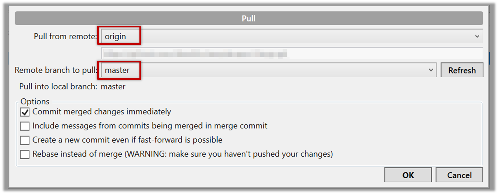

1. Open the local repo in SourceTree. Suggested: Use your local clone of the `samplerepo-things` repo.

1. Choose `Repository` → `Repository Settings` menu option.

1. Add a new _remote_ to the repo with the following values.

   

   * `Remote name`: the name you want to assign to the remote repo e.g., `upstream1`
   * `URL/path`: the URL of your repo (ending in `.git`) that. Suggested: `https://github.com/se-edu/samplerepo-things-2.git` ([`samplerepo-things-2`](https://github.com/se-edu/samplerepo-things-2) is another repo that has a shared history with `samplerepo-things`)
   * `Username`: your GitHub username  

1. Now, you can fetch or pull (pulling will fetch the branch _and_ merge the new code to the current branch) from the added repo as you did before ==but choose the remote name of the repo you want to pull from== (instead of `origin`): 
   Click the `Fetch` button or the `Pull` button first. 
   
   

   <box type="tip" seamless>

   If the `Remote branch to pull` dropdown is empty, click the `Refresh` button on its right.
   </box>

1. If the pull from the `samplerepo-things-2` was successful, you should have received one more commit into your local repo.
