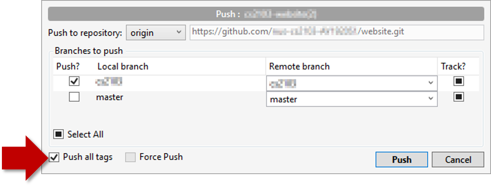

Click the `Push` button on the main menu, ensure the settings are as follows in the next dialog, and click the `Push` button on the dialog.

<box type="warning">

Tags are not included in a normal push. Remember to tick `Push all tags` when pushing to the remote repo if you want them to be pushed to the repo. 

</box>

