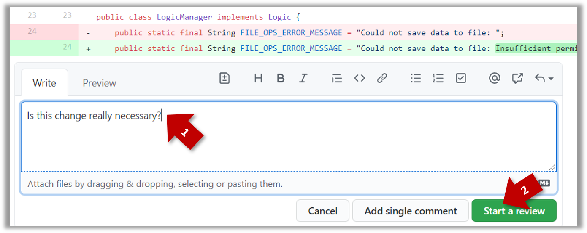

<span id="title">Reviewing PRs</span>

<span id="prereqs"></span>

<span id="outcomes">{{ icon_outcome }} Can review PRs on GitHub</span>

<span class="btn btn-light border">{{ text }} :octicon-triangle-down:</span>
<span class="btn btn-success pl-1 pr-1 pb-0 pt-0">{{ text }}</span>
<span class="btn btn-light pl-1 pr-1 pb-0 pt-0 border">{{ text }}</span>

<div id="body">

_PR review_ stage is a dialog between the PR author and members of the repo that received the PR, in order to refine and eventually merge the PR.

Given below are some steps you can follow when reviewing a PR.

**1. Locate the PR:**
1. Go to the GitHub page of the repo.
1. Click on the <span class="tab">{{ icon_pr }} Pull requests</span> tab.
1. Click on the PR you want to review.

**2. Read the PR description.** It might contain information relevant to reviewing the PR.

**3. Click on the** <span class="tab">:octicon-diff: Files changed</span> tab to see the _diff_ view.

**4. Add review comments:**
1. Hover over the line you want to comment on and click on the <span style="color:#0066ff">:fas-plus-square:</span> icon that appears on the left margin. That should create a text box for you to enter your comment.<br>
   {{ icon_tip }} To mark multiple lines, click-and-drag the <span style="color:#0066ff">:fas-plus-square:</span> icon.
1. Enter your comment.<br>
   {{ icon_resource }} [This page @SE-EDU/guides](https://se-education.org/guides/guidelines/PRs-reviewing.html) has some best practices PR reviewers can follow.
1. After typing in the comment, click on the {{ button_green("Start a revew") }} button (not the {{ button_light("Add single comment") }} button. This way, your comment is saved but not visible to others yet. It will be visible to others only when you have finished the entire review.<br>
   
   <p/>
1. Repeat the above steps to add more comments.

**5. Submit the review:**<br>
   
   <p/>

1. When there are no more comments to add, click on the {{ button_green("Review changes :octicon-triangle-down:") }} button (on the top right of the diff page).
1. Type in an overall comment about the PR, if any.e.g.,<br>e.g.,
   ```
   Overall, I found your code easy to read for the most part except a few places
   where the nesting was too deep. I noted a few minor coding standard violations
   too. Some of the classes are getting quite long. Consider splitting into smaller
   classes if that makes sense.
   ```
   {{ icon_tip }} `LGTM` is often used in such overall comments, to indicate `Looks good to merge`.<br>
   `nit` is another such term, used to indicate minor flaw e.g., `LGTM, almost. Just a few nits to fix.`
1. Choose `Approve`, `Comment`, or `Request changes` option as appropriate and click on the {{ button_green("Submit review") }} button.

</div>

<div id="extras">
   <include src="resources.md" />
</div>