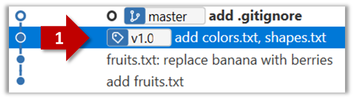

Right-click on the commit (in the graphical revision graph) you want to tag and choose `Tag…`

Specify the tag name e.g. `v1.0` and click `Add Tag`.

The added tag will appear in the revision graph view.

<box type="warning">

Tags are not included in a normal push. Remember to tick `Push all tags` when pushing to the remote repo if you want them to be pushed to the repo. 

</box>

