# JavaFx 8 tutorial - Part 1: Scene Builder

Adapted (with permissions) from [Marco Jakob's JavaFX 8 tutorial](http://code.makery.ch/library/javafx-8-tutorial/). Thanks to [Marco Jakob](https://github.com/marcojakob) for allowing us to adapt this tutorial for IntelliJ.

## Introduction

This tutorial will teach you how to create a new JavaFX application in IntelliJ, and to use the SceneBuilder to create a layouts for your application. We will also cover on applying the [Model-View-Controller](https://en.wikipedia.org/wiki/Model_View_Controller) pattern on your project.

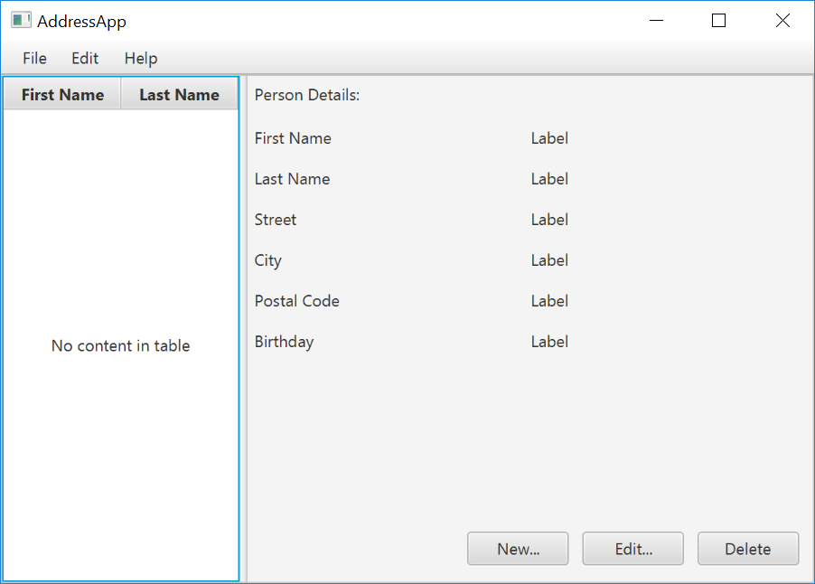

## Prerequisites

* Latest [Java JDK 8](http://www.oracle.com/technetwork/java/javase/downloads/index.html) (includes *JavaFX 8*)
* IntelliJ (2017.2 or later)
* [SceneBuilder 8](http://gluonhq.com/products/scene-builder/) (provided by Gluon as [Oracle no longer ships the tool in binary form](http://www.oracle.com/technetwork/java/javase/downloads/sb2download-2177776.html))

> Tip:
> Do remember the installation path to SceneBuilder 8 as we will need to configure it later in IntelliJ (under <<Configuring Scene Builder>>).

## IntelliJ Configurations

If this is the first time using IntelliJ, you need to tell IntelliJ where to find JDK 8 and SceneBuilder.

### Configuring JDK 8

1. On the Welcome screen, press `Configure` -> `Project Default` -> `Project Structure`.
    
    * If you already have a project open, go to the Welcome screen by going to `File` -> `Close Project`.

1. Under `Project SDK:`, press `New...` -> `JDK`.
1. Select the directory that you install JDK on, and press `OK`.
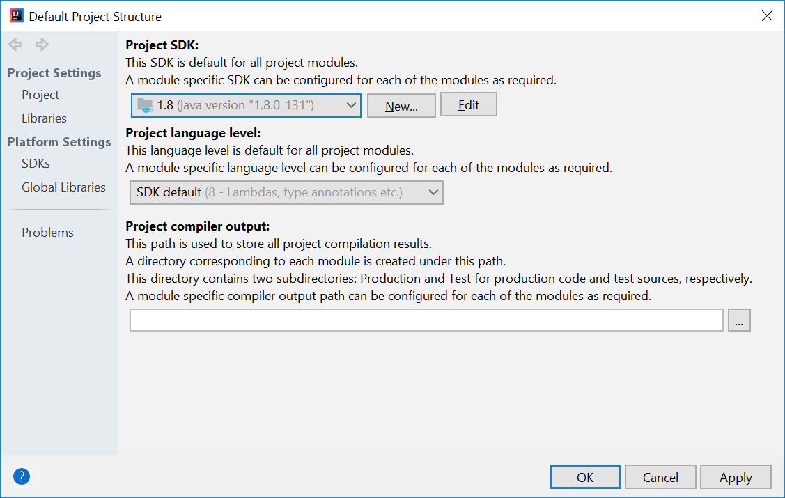

1. Press `OK` again.

### Configuring Scene Builder

1. On the Welcome screen, press `Configure` -> `Settings`.
1. On the left hand side, select `Languages & Frameworks` -> `JavaFX`
1. Under `Path to SceneBuilder:`, select the path to where SceneBuilder is installed (e.g. `C:\Users\Admin\AppData\Local\SceneBuilder\SceneBuilder.exe` on Windows)


## Helpful Links

The JavaDocs will come in handy when writing your own JavaFX applications:

* [Java 8 API](http://docs.oracle.com/javase/8/docs/api/)
* [JavaFX 8 API](http://docs.oracle.com/javase/8/javafx/api/)
* [ControlsFX API](http://controlsfx.bitbucket.org/)

Additionally, [Oracle also has a tutorial on JavaFX](http://docs.oracle.com/javase/8/javafx/get-started-tutorial/get_start_apps.htm) if you are interested.

## Create a new JavaFX Project

1. On the Welcome screen, press `Create New Project`.
    * If you already have a project, you can create a new project by going `File` -> `New` -> `Project...`.
1. On the left side, select `JavaFX`. Make sure that the Project SDK is set to `1.8` and `JavaFX Application` is selected.
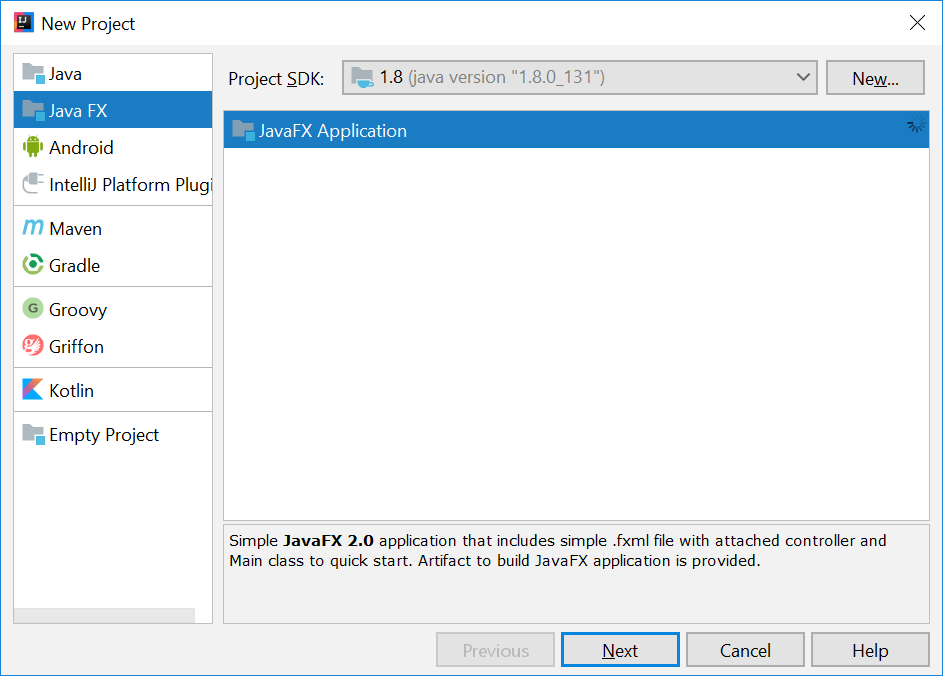

1. Press `Next`.
1. Give a name for the application (e.g. `AddressApp`), and specify a suitable location.
1. Press `Finish`. If prompted to create a new directory, just press `OK`.

Remove the `sample` package and its content. We will manually create our own package and resources in our tutorial.

## Create the Packages

In our tutorial, we will organize our code properly right at the start, following the [Model-View-Controller](https://en.wikipedia.org/wiki/Model_View_Controller) pattern.

We will create a package for each of the component. Ensure that your Project pane is open (<kbd>Alt</kbd>+<kbd>1</kbd>). Right click on the `src` folder, and select `New` -> `Package`:

* `seedu.address` - contains the controller classes (= business logic)
* `seedu.address.model` - contains the model classes
* `seedu.address.view` - contains the views

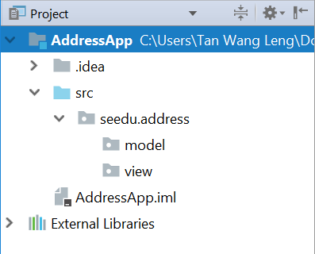

> Note:
> In subsequent tutorials, our `view` package will also contain some controllers that are directly related to a single view. We will call them `view-controllers`.

## Create the FXML Layout File

There are two ways to create the UI:

* Use FXML, which is an XML format.
* Programmatically create the interface in Java.

We will use FXML for most parts, so that we can separate the view and controller from each other. Furthermore, we are able to use the Scene Builder tool to edit our FXML file. That means we will not have to directly work with XML.

Right click on the `view` package, and press `New` -> `FXML file`. For the file name, type `PersonOverview.fxml`.

## Design with Scene Builder

Right-click on `PersonOverview.fxml` and choose `Open with Scene Builder`. Now you should see the Scene Builder with just an AnchorPane (visible under Hierarchy on the left).

> Note:
> If IntelliJ prompts for a location of the SceneBuilder executable, make sure to point to where you install SceneBuilder.

1. Select the `Anchor Pane` in your Hierarchy, and adjust the size under Layout (right side). (Pref Width: 600, Pref Height: 300)<br>
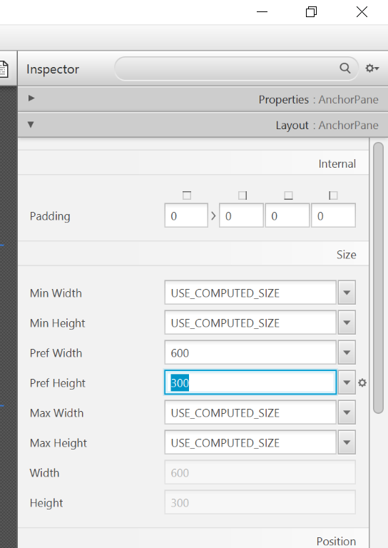

1. Add a `Split Pane (Horizontal Flow)` (under `Containers`) by dragging it from the Library into the main area. Right-click the `Split Pane` in the Hierarchy view and select `Fit to Parent`.<br>


1. Drag a `TableView` (under `Controls` in Library view) into the left side of the `SplitPane`. Select the `TableView` (not a Column) and set the following layout constraints in the Inspector to the `TableView`. Inside an `AnchorPane` you can always set anchors to the four borders<br> (http://docs.oracle.com/javase/8/javafx/layout-tutorial/builtin_layouts.htm[more information on Layouts]).
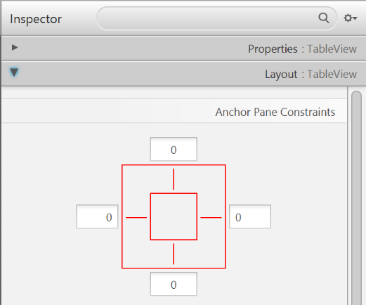

1. Go to the menu `Preview` -> `Show Preview in Window` to see whether the layout configuration is done correctly. Try resizing the window. The `TableView` should resize together with the window as it is anchored to the borders.
1. Change the column text (under Properties) to "First Name" and "Last Name".<br>
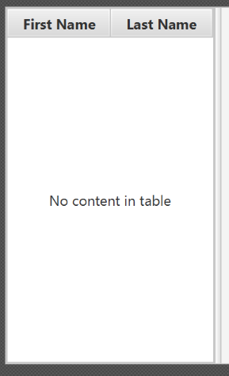

1. Select the `TableView` and choose `constrainted-resize` for the 'Column Resize Policy'. This ensures that the columns will always fill up the entire available space.<br>
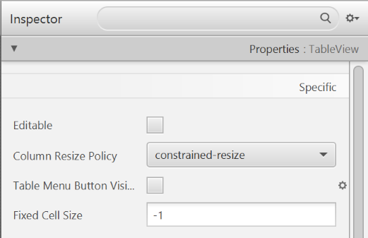

1. Add a `Label` on the right side with the text "Person Details:". Adjust the layout using anchors (Top: 5, Left: 5. Right: Blank, Bottom: Blank).<br>
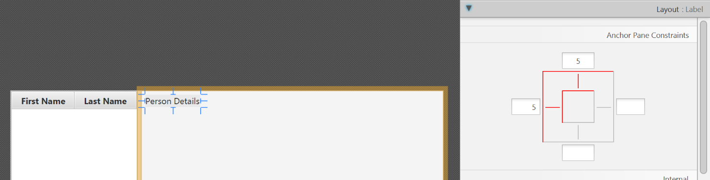
> Tip:
> You can use the Search Bar at the top of Library/Inspector to find the respective controls/properties.

1. Add a `GridPane` on the right side. Select it, and adjust its layout using anchors (Top: 30, Left: 5, Right: 5, Bottom: Blank).<br>
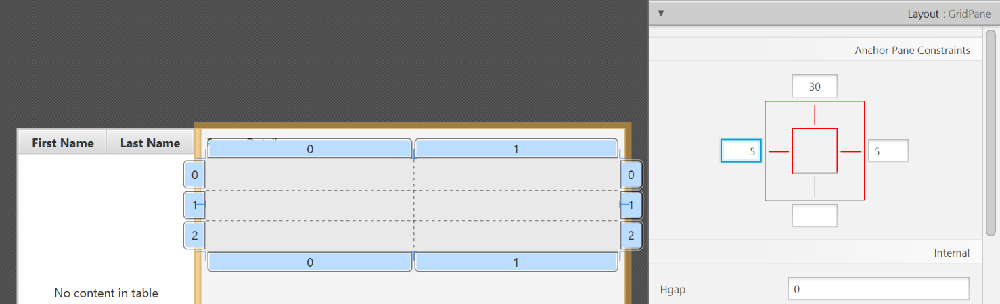

1. Add the following labels to the cells, such that the grid is of this form:

| First Name | Label |
| --- | --- |
| Last Name | Label |
| Street | Label |
| City | Label |
| Postal Code | Label |
| Birthday | Label |

> Tip:
> To add a row to the GridPane, select an existing row number, right click the row number and choose "Add Row Below".

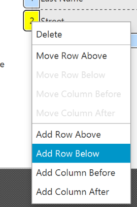
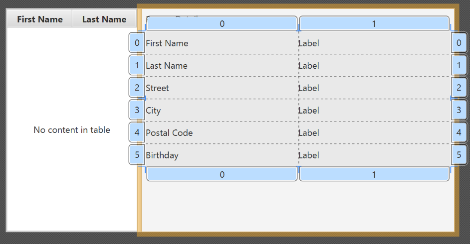

1. Add a `ButtonBar` at the bottom. Add three buttons to the bar ("New...", "Edit...","Delete"). Adjust the anchors so that it stays at the bottom right (Top: Blank, Left: Blank, Right: 10, Bottom: 5).<br>


1. Now you should see something like the following. Use the `Preview` menu to test its resizing behaviour.<br>
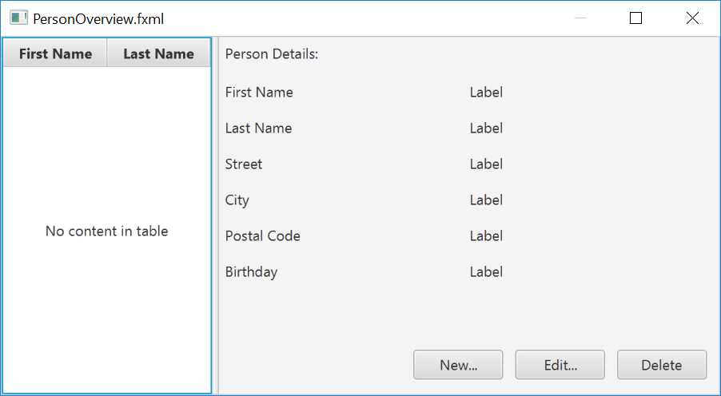

1. Save the `.fxml` file.

## Create the Main Application

The `PersonOverview.fxml` that we just created only contains the content of our entire application. We need another FXML for our root layout, which will contain a menu bar and wraps `PersonOverview.fxml`.

1. Inside IntelliJ, right click on the `view` package, and press `New` -> `FXML file`. For the file name, type `RootLayout.fxml`.
1. Right-click on `RootLayout.fxml` and choose `Open with Scene Builder`.
1. Delete the `AnchorPane`. We will use another pane for our root layout.


1. Add `BorderPane` by dragging it from the Library view into the main area.


1. Resize the `BorderPane` (Pref Width: 600, Pref Height: 400)
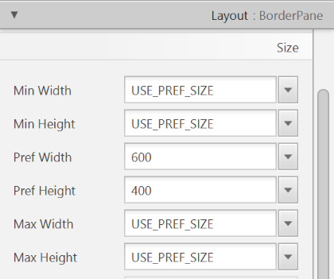

1. Add a `MenuBar` into the `insert TOP` slot. We will not implement menu functionality for now.


## The JavaFX Main Class

Now, we need to create the *main Java class* that starts up our application with the `RootLayout.fxml` and adds the `PersonOverview.fxml` in the center.

Right-click on your `seedu.address` package, and choose `New` -> `JavaFXApplication`. For the class name, type `MainApp`.

The generated `MainApp.java` class extends from `Application` and contains two methods. This is the basic structure that we need to start a JavaFX Application. The most important part for us is the `start(Stage primaryStage)` method. It is automatically called when the application is `launch()` from within the `main()` method.

As you see, the `start(...)` method receives a `Stage` as parameter. The following graphic illustrates the structure of every JavaFX application:


Image Source: http://www.oracle.com

*It's like a theater play:* The `Stage` is the main container which is usually a `Window` with a border and the typical minimize, maximize and close buttons. Inside the `Stage` you add a `Scene` which can, of course, be switched out by another `Scene`. Inside the `Scene` the actual JavaFX nodes like `AnchorPane`, `TextBox`, etc. are added.

For more information regarding this, see http://docs.oracle.com/javase/8/javafx/scene-graph-tutorial/scenegraph.htm[Working with the JavaFX Scene Graph].

---

Open `MainApp.java` and replace the code with the following:

**MainApp.java**
```java
package seedu.address;

import java.io.IOException;

import javafx.application.Application;
import javafx.fxml.FXMLLoader;
import javafx.scene.Scene;
import javafx.scene.layout.AnchorPane;
import javafx.scene.layout.BorderPane;
import javafx.stage.Stage;

public class MainApp extends Application {
    private Stage primaryStage;
    private BorderPane rootLayout;

    @Override
    public void start(Stage primaryStage) {
        this.primaryStage = primaryStage;
        this.primaryStage.setTitle("AddressApp");

        initRootLayout();

        showPersonOverview();
    }

    /**
     * Initializes the root layout.
     */
    public void initRootLayout() {
        try {
            // Load root layout from fxml file.
            FXMLLoader loader = new FXMLLoader();
            loader.setLocation(MainApp.class.getResource("view/RootLayout.fxml"));
            rootLayout = loader.load();

            // Show the scene containing the root layout.
            Scene scene = new Scene(rootLayout);
            primaryStage.setScene(scene);
            primaryStage.show();
        } catch (IOException e) {
            e.printStackTrace();
        }
    }

    /**
     * Shows the person overview inside the root layout.
     */
    public void showPersonOverview() {
        try {
            // Load person overview.
            FXMLLoader loader = new FXMLLoader();
            loader.setLocation(MainApp.class.getResource("view/PersonOverview.fxml"));
            AnchorPane personOverview = loader.load();

            // Set person overview into the center of root layout.
            rootLayout.setCenter(personOverview);
        } catch (IOException e) {
            e.printStackTrace();
        }
    }

    /**
     * Returns the main stage.
     */
    public Stage getPrimaryStage() {
        return primaryStage;
    }

    public static void main(String[] args) {
        launch(args);
    }
}
```

The various comments should give you some hints about what's going on.

If you run the application now (right click `MainApp.java` and select `Run MainApp.main()`), you should see something like this:


## Possible Issues

If JavaFx fails to load `PersonOverview.fxml`, you might get the following error message:

```
javafx.fxml.LoadException:
/.../AddressApp/out/production/AddressApp/seedu/address/view/PersonOverview.fxml:15
```

To solve this issue, open `PersonOverview.fxml` normally in IntelliJ and ensure that there is no such attribute around:

`fx:controller="seedu.address.view.PersonOverview"`

## What's Next

In [Part 2](../part02/part02.md), we will add some data and functionality to our `AddressApp`.
