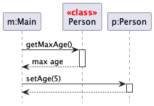
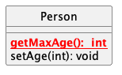

Calls to Static Methods

{{ icon_outcome }} Can show calls to static methods

Method calls to `static` i.e., class-level method are received by the class itself, not an instance of that class. We can use the `<<class>>` to show that a participant is the class itself. 

<box>

{{ icon_example }} In this example, `m` calls the static method `Person.getMaxAge()` and also the `setAge()` method of a `Person` object `p`.
 

Here is the `Person` class, for reference: 

</box>

